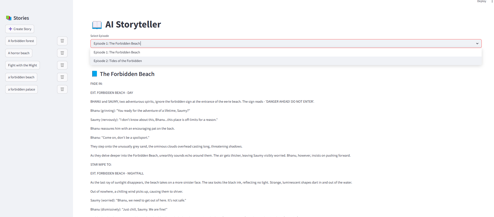
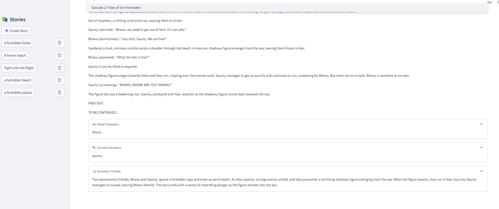

# 🎙️ KuKu-FM AI Storyteller: Autonomous Episodic Audio-Drama Engine

[](https://www.python.org/downloads/)
[](https://streamlit.io/)
[](https://openai.com/)
[](https://opensource.org/licenses/MIT)

An end-to-end AI-powered narrative architecture engineered for audio-first storytelling platforms like **KuKu-FM**. The engine automatically constructs rich, multi-episode serialized fiction featuring persistent character tracking, adaptive cliffhangers, memory-efficient progressive summarization, and multi-lingual regional adaptation.

---

## 🌟 Highlights & Architecture

- **Serialized Episodic Generation**: Creates coherent multi-part episodic arcs with custom episode counts, distinct acts, and continuous plot development.
- **Strict Character State & Lifecycle Tracking**: Maintains persistent character states across episodes. Entities are guaranteed to debut in Episode 1, evolve throughout, and death events permanently update future narrative availability.
- **Dynamic Cliffhanger Engine**: Each episode concludes on a high-tension hook designed to maximize listener retention and bingeability.
- **Rolling Contextual Summarization**: Employs an abstractive summarization layer using OpenAI to distill prior episodes into concise, rich narrative memory without exceeding model token limits.
- **Regional & Cultural Localization**: Seamlessly infuses regional settings, cultural idioms, and geographic nuance into character dialogue and background descriptions.
- **Multi-Lingual Translation Pipeline**: Integrated translation layer to translate serialized audio scripts into regional vernaculars.
- **Structured JSON Output**: Every episode generation follows schema validation guaranteeing structured metadata (`title`, `body`, `killed_characters`, `current_characters`, `ended_at`, `summary_till_now`).

---

## 📸 Interface Preview

| Episode Explorer & Reader | Story & Arc Customizer |
| :---: | :---: |
|  |  |

<p align="center">
  <b>Progressive Story Summary & Context Inspector</b><br>
  
</p>

---

## 🛠️ System Workflow

```
[ User Configuration ]
  ├── Story Title & Premise
  ├── Target Episode Count
  ├── Characters & Archetypes
  ├── Tone & Tropes (e.g. Thriller, Enemies-to-Lovers)
  └── Regional Setting (e.g. Rural UP, Coastal Kerala)
          │
          ▼
[ Outline Generator (outlines.py) ]
  ├── High-level Episode Breakdown
  ├── Narrative Arc & Tension Curve Planning
  └── Human-in-the-Loop Feedback & Refinement
          │
          ▼
[ Episodic Production Engine (story_generator.py) ]
  ├── Context Synthesis (Rolling Summary + Active Characters)
  ├── GPT-4 Episode Generation (Plot + Dialogues + Cliffhanger)
  ├── Character State Mutation (Active vs. Deceased tracking)
  └── Abstractive Summarizer (Updates rolling context for Ep N+1)
          │
          ▼
[ Validation & Persistence ]
  ├── Strict JSON Parsing & Repair (json_parse.py)
  └── Export to Local Story Store (/story/<title>/)
```

---

## 🚀 Getting Started

### Prerequisites

- Python 3.8 or higher
- Valid OpenAI API Key

### Installation

1. **Clone the repository:**
   ```bash
   git clone https://github.com/bloodykunu39/episodic-narrative-engine.git
   cd episodic-narrative-engine
   ```

2. **Set up a virtual environment:**
   ```bash
   python -m venv venv
   # On Windows:
   venv\Scripts\activate
   # On Linux/macOS:
   source venv/bin/activate
   ```

3. **Install dependencies:**
   ```bash
   pip install -r requirements.txt
   python -m spacy download en_core_web_sm
   ```

4. **Set up Environment Variables:**
   Create a `.env` file in the project root:
   ```env
   OPENAI_API_KEY=your_openai_api_key_here
   ```

5. **Run the Streamlit application:**
   ```bash
   streamlit run main.py
   ```

   The web UI will be live at: `http://localhost:8501`

---

## 📂 Repository Structure

```
episodic-narrative-engine/
├── main.py                     # Streamlit frontend application & UI navigation
├── outlines.py                 # Multi-episode narrative outline generator & flow manager
├── story_generator.py          # Core episode generation, character lifecycle & summarizer
├── json_parse.py               # Robust JSON validation & parsing utilities
├── test.py                     # Standalone CLI validation test script
├── requirements.txt            # Project dependencies
├── images/                     # UI screenshots & visual assets
├── story/                      # Library of pre-generated episodic audio stories
│   ├── a tale of two boys/
│   ├── A quest for the golden egg/
│   ├── Lion as a saviour/
│   ├── Rat and a Cat/
│   └── Someone for Everyone/
└── Translation_test/           # Regional translation & tokenization scripts
    └── translation_script.py
```

---

## ⚙️ Configuration Parameters

| Parameter | Options / Examples | Description |
|---|---|---|
| **Tone** | Comedic, Dark, Thriller, Romantic, Mystical | Sets the emotional atmosphere and dialogue style |
| **Trope** | Hero's Journey, Enemies to Lovers, Underdog Triumph | Guiding narrative structure and thematic progression |
| **Perspective** | First Person, Third Person Omniscient | Point-of-view of narration |
| **Regional Setting** | Uttar Pradesh, Mumbai, Kerala, Scottish Highlands | Grounding details, environment, and dialect flavor |
| **Episode Count** | 2 to 10+ episodes | Granularity and length of the serial story |

---

## 👤 Author

Developed by **Karan Singh** ([@bloodykunu39](https://github.com/bloodykunu39))

---

## 📄 License

This project is open-source and available under the [MIT License](LICENSE).
